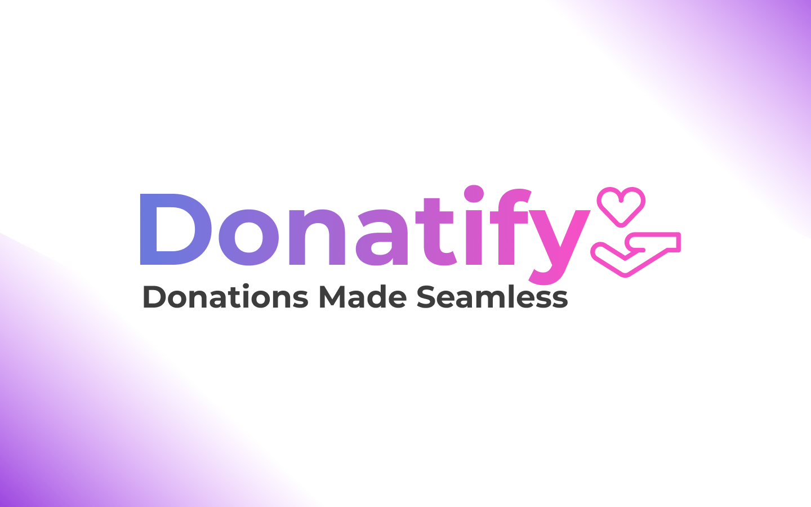

## Donatify

### Inspiration

There is a major problem affecting the net amount of donations to certain charities events. Due to online forms of currency such as crypto, society has been quickly turning cashless, with these trends likely to increase. This heavily affects the way donations are made. Spontaneous In-person donations rely on people having loose change to give, but due to the lack of change, donation amounts and frequencies are seeing lower and lower rates.

Donating loose change is good, its seamless. What if there was a way to donate change online, while keeping the concept easy is stressless?

### What it does

Donatify solves this problem, simply go to our site and create an account, choose an charity or event you want to help support, and download our chrome extension. Simple as that. Donatify works by detecting whenever you purchase a product online (similar to the popular extension honey). The donatify web extension then rounds the purchase cost up to the nearest dollar, and adds that donation fee to a pot. Once a pot reaches a certain amount (lets say $20), a transaction is made with the capitalone API to the charity of your choice.

### How we built it

So how did we design it? We sat down as a team and discussed social problems and solutions to the sustainable development goals quickly. We quickly realised that none of us had donated cash in a while and started to come up with solutions. We created a mood board and low level user interface on Figma and ultimately came up with this project. The project was made with Flask for the site and javascript for the web extension with a google cloud serverless function backend. It is hosted on Heroku. We use Twilio for sms notifications for when users reach a certain donation goal. CockroachDB is used as the main database for the entire project, and the GCP serverless functions wrap around the cockroachdb database as well as the capitalOne Nessie API (which was used for storing account data).
